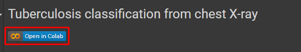

# Tuberculosis classification using chest X-ray images
Mycobacterium tuberculosis is the bacterium that causes the infectious illness tuberculosis
(TB). The lungs are the primary organs affected, but the kidneys, spine, and brain can
also be impacted. An effective and extensively used diagnostic method for finding TB is
a chest X-ray.\
This project aims to classify chest X-ray images into two classes: normal and TB using Convolutional Neural Networks (CNNs).

## Dataset
The dataset is taken from Kaggle [Tubersulosis Chest X-ray dataset](https://www.kaggle.com/datasets/tawsifurrahman/tuberculosis-tb-chest-xray-dataset) that contains (Chest X-RAY) CXR images of Normal
(3500) and patients with Tuberculosis (TB) (700 TB images in publicly accessible).

## Usage
The project was done using Google Colab and is expected to be run on it. The dataset is uploaded to Google Drive and downloaded to the Colab notebook.

The notebook is self-explanatory and can be run cell by cell. Click on open in Colab button to open the notebook in Colab.

Also, the notebook uses Weights and Biases for logging and experiment tracking. You can create a free account on [Weights and Biases](https://wandb.ai/site) and use the API key to log in to the notebook. The API key can be found in your account settings.

## Author
Suraj Poudel

## License
